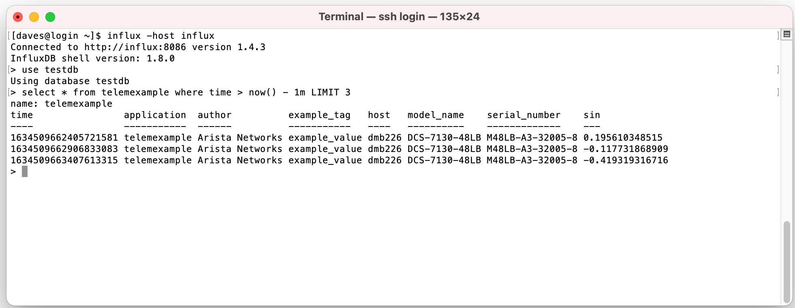
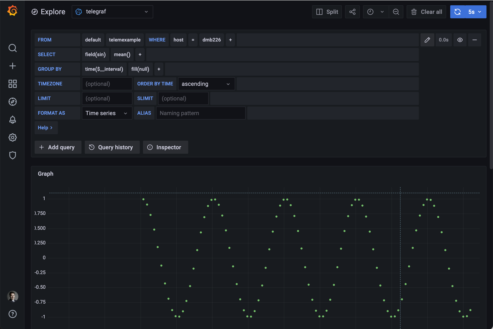
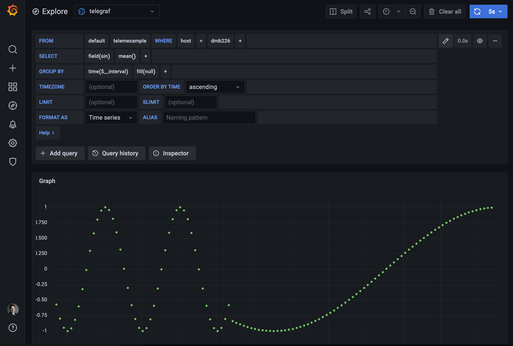

# Using the `telemexample` Example

## Contents

                                                                                        
- [`Installation`](#installation)
    - [`EOS Installation`](#eos-installation)
    
- [`Using the `telemexample` Example on a Device`](#usage)
    - [`Using the Example on a Device Running EOS`](#using-the-example-on-a-device-running-eos)
    

- [`Additional Usage Information`](#additional-usage-information)
    - [`Example Usage`](#example-usage)


- [`eAPI`](#eapi)

---

## Installation


### EOS Installation

To load the example app onto a device running EOS, first copy the SWIX to the switch:

```bash
scp telemexample-XXX.swix admin@hostname:
```

Then log into the device and run:

```console
hostname> en
hostname# conf
hostname(config)# copy flash:telemexample-XXX.swix extension:
hostname(config)# extension telemexample-XXX.swix
```

You can show the state of the currently installed extension by running ``show extensions``.
For example:

```console
hostname#show extensions
Name                                       Version/Release      Status      Extension
------------------------------------------ -------------------- ----------- ---------
telemexample-XXX.x86_64.swix              0.0.0/28             A, I        1

A: available | NA: not available | I: installed | NI: not installed | F: forced
S: valid signature | NS: invalid signature
The extensions are stored on internal flash (flash:)
```

Please note, because of the EOS CliPlugin framework your current CLI session will terminate, so you'll have to log back into the switch.
If you reboot the switch and the SWIX is also in boot-extensions, the CLI Extension will be automatically registered after a reboot.


### MOS Installation

In order to start the TelemExample example application it must be installed. To do so, copy the generated RPM to your device and install:

```bash
scp telemexample-XXX.rpm admin@hostname:
```

Log into the device and run:

```console
hostname> en
hostname# conf
hostname(config)# install app telemexample-XXX.rpm
hostname(config)# exit
hostname# exit
```

Log out of the device and then back in to refresh the CLI.

You can see the apps installed on your device using the `show application` command.


---

## <a id="usage"></a>Using the `telemexample` Example on a Device


### Using the Example on a Device Running EOS

`show` commands display the status of the application::

```console
hostname#show telemexample status
Enabled: No
Running: No
```

The application can be started via the `no disabled` command:

```console
hostname#config
hostname(config)#telemexample
hostname(config-telemexample)#no disabled
```

at which point the software will take some small amount of time to start, and
following that, the application will show as `Enabled` and `Running`:

```console
hostname#show telemexample status
Enabled: Yes
Running: Yes
```

The running configuration will also reflect the new configuration:

```console
hostname(config-telemexample)#show running-config
<other config snipped>
!
telemexample
   no disabled
!
```


### Using the Example on a Device Running MOS

> **_Note:_** This example does not support MOS, but the libraries used to implement 
      telemetry do. If you require an example of MOS support for streaming telemetry
      please get in touch with us as fdk-support@arista.com.


---

## Additional Usage Information

## Example Usage

The `TelemExample` app starts a daemon which will send time-series telemetry.
The time-series telemetry is, in this case, generated function data (i.e. a
sine wave), however time-series telemetry is very useful for real-world
applications like:

* packet counters
* Time synchronisation offsets
* Buffer depths
* Application events
* Trading data

`TelemExample` takes advantage of EOS's support for streaming Telemetry in
InfluxDB line format. That feature can be enabled via configuration like the
below. This snippet configure's the Telegraf instance on EOS with an InfluxDB
output called "Sydney", which resides at `http://influx.metamako.com:8086`. The
data will be inserted into the `testdb` database. For further information about
configuring streaming telemetry output, refer to [https://eos.arista.com/eos-4-25-2f/influxdb-telemetry-streaming/](https://eos.arista.com/eos-4-25-2f/influxdb-telemetry-streaming/).

```text
monitor telemetry influx
   destination influxdb sydney
      url http://influx.metamako.com:8086
      database name testdb
```

Once the telemetry output is configured, as above, and the app is started, it
will begin to output an InfluxDB measurement called `telemexample`. This can be
queried and plotted in all the ways available for InfluxDB - for example: 

*Via CLI Query:*


*Via Grafana:*


You can control the period of the oscillations using another config command: 

```console
telemexample
   period 60.0
```

which leads to the period of the functions changing:


For clarity, the total config required to achieve this is given here: 

```text
monitor telemetry influx
   destination influxdb sydney
      url http://influx.metamako.com:8086
      database name testdb

telemexample
   period 60.0
   no disabled
```


---

## eAPI

Building commands using EOSSDK also gives access via eAPI. For example, after enabling the eAPI, CURL commands return structured json output.

To enable eAPI in EOS:

```console
management api http-commands
no shutdown
```

Enabling eAPI is slightly differrent in MOS:

```console
configure
management http
no protocol secure
management api
no shutdown
end
```


