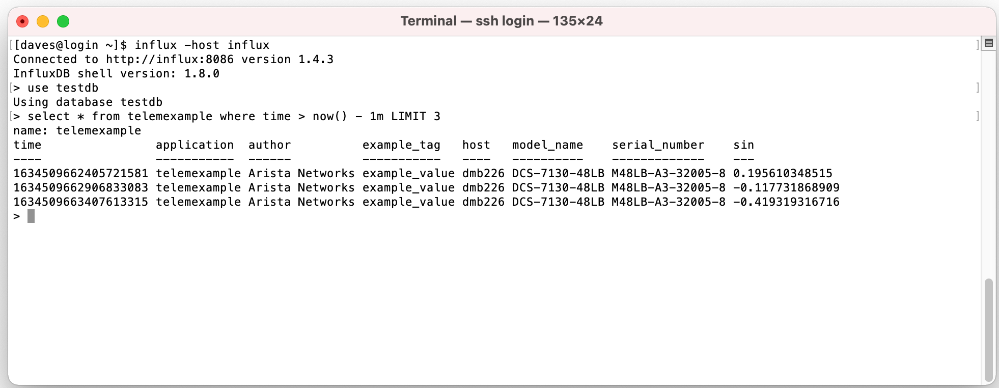
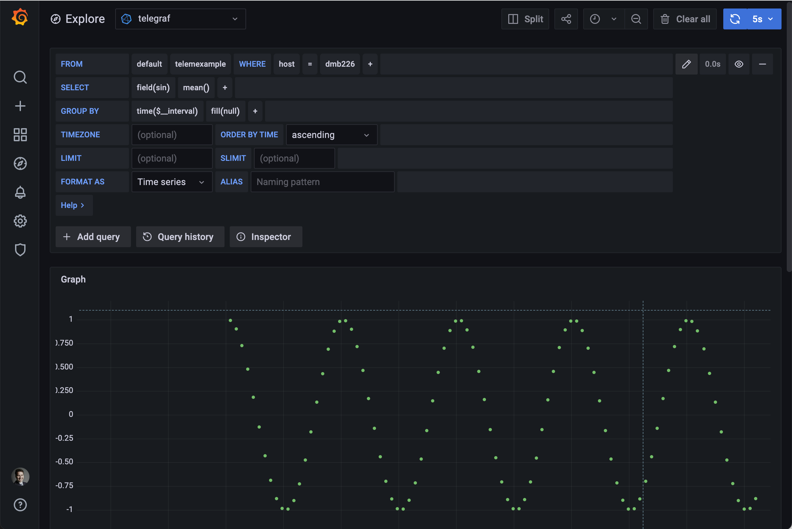
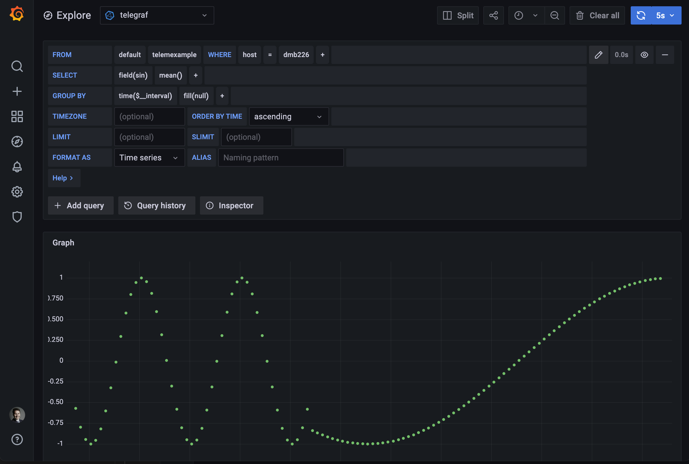

# Using the `telemexample` Example

## Contents

- [`Installation`](#installation)
  - [`EOS Installation`](#eos-installation)

- [Using the telemexample Example on a Device](#usage)
  - [`Using the Example on a Device Running EOS`](#using-the-example-on-a-device-running-eos)


- [`Additional Usage Information`](#additional-usage-information)
  - [`Example Usage`](#example-usage)


- [`eAPI`](#eapi)

---

## Installation


### EOS Installation

To load the example app onto a device running EOS, first copy the SWIX to the
switch:

```bash
scp telemexample-VERSION-RELEASE.swix admin@hostname:
```

Then log into the device and run:

```console
hostname> enable
hostname# configure
hostname(config)# copy flash:telemexample-VERSION-RELEASE.swix extension:
hostname(config)# extension telemexample-VERSION-RELEASE.swix
```

You can show the state of the currently installed extension by running
`show extensions`. For example:

```console
hostname# show extensions
Name                                       Version/Release      Status      Extension
------------------------------------------ -------------------- ----------- ---------
telemexample-VERSION-RELEASE.swix          0.0.0/28             A, I        1

A: available | NA: not available | I: installed | NI: not installed | F: forced
S: valid signature | NS: invalid signature
The extensions are stored on internal flash (flash:)
```

To persist the installed extension across reboots, copy it to boot-extensions:

```console
hostname# copy installed-extensions boot-extensions
```

Please note, because of the EOS CliPlugin framework your current CLI session
will terminate, so you'll have to log back into the switch. If you reboot the
switch and the SWIX is also in boot-extensions, the CLI Extension will be
automatically registered after a reboot.


---

## <a id="usage"></a>Using the `telemexample` Example on a Device


### Using the Example on a Device Running EOS

The application is disabled by default. Its status can be displayed from
unprivileged or privileged EXEC mode:

```console
hostname> show telemexample status
Enabled: No
Running: No
```

Enter the application configuration mode and use `no disabled` to start the
daemon:

```console
hostname> enable
hostname# configure
hostname(config)# telemexample
hostname(config-telemexample)# no disabled
```

When startup has completed, both status fields are `Yes`:

```console
hostname(config-telemexample)# show telemexample status
Enabled: Yes
Running: Yes
```

Set the sine-wave period in seconds with `period <period>`. The status output
then includes the effective configured setting:

```console
hostname(config-telemexample)# period 3.0
hostname(config-telemexample)# show telemexample status
Enabled: Yes
Running: Yes
Setting   Value
--------- -----
period    3.0
```

Use `no period` to remove the setting. The daemon returns to its default
10-second period, and `period` is no longer listed by the status command.

```console
hostname(config-telemexample)# no period
hostname(config-telemexample)# show telemexample status
Enabled: Yes
Running: Yes
```

The application configuration is visible in the running configuration:

```console
hostname(config-telemexample)# show running-config section telemexample
telemexample
   no disabled
```

Use `disabled` to stop the daemon. Configuration such as `period` is retained
for its next start, while status returns to `Enabled: No` and `Running: No`.

```console
hostname(config-telemexample)# disabled
hostname(config-telemexample)# show telemexample status
Enabled: No
Running: No
```


---

## Additional Usage Information

## Example Usage

The `TelemExample` app starts a daemon which will send time-series telemetry.
In this example, the data is a generated sine wave. Time-series telemetry is
also useful for real-world data such as:

- packet counters
- time-synchronisation offsets
- buffer depths
- application events
- trading data

`TelemExample` uses EOS support for streaming telemetry in InfluxDB line
format. The following configures an InfluxDB destination named `sydney` and
stores data in the `test` database:

```console
hostname# configure
hostname(config)# monitor telemetry influx
hostname(config-monitor-telemetry-influx)# destination influxdb sydney
hostname(config-monitor-telemetry-influx-dest-sydney)# url http://influx.metamako.com:8086
hostname(config-monitor-telemetry-influx-dest-sydney)# database name test
```

Verify that Telegraf is running and that `sydney` is present in the configured
destinations:

```console
hostname# show monitor telemetry influx
```

Once the telemetry output is configured and the app is running, it emits the
InfluxDB measurement `telemexample`. A query equivalent to the one used to
verify the example is:

```console
> select * from telemexample where time > now() - 1m
```

The measurement can also be queried and plotted with InfluxDB tools:

_Via CLI Query:_ 

_Via Grafana:_ 

Changing `period` changes the oscillation period:


For clarity, the complete relevant running configuration is:

```console
monitor telemetry influx
   destination influxdb sydney
      url http://influx.metamako.com:8086
      database name test

telemexample
   period 60.0
   no disabled
```

Remove the telemetry destination when it is no longer needed:

```console
hostname(config-monitor-telemetry-influx)# no destination influxdb sydney
```


---

## eAPI

Building commands using EOSSDK also gives access via eAPI. For example, after
enabling the eAPI, CURL commands return structured json output.

To enable eAPI in EOS:

```console
management api http-commands
no shutdown
```
